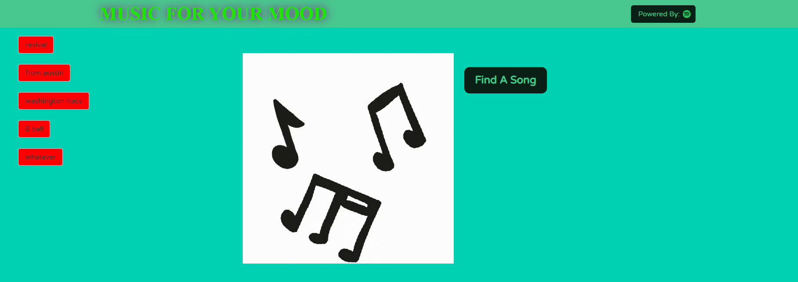
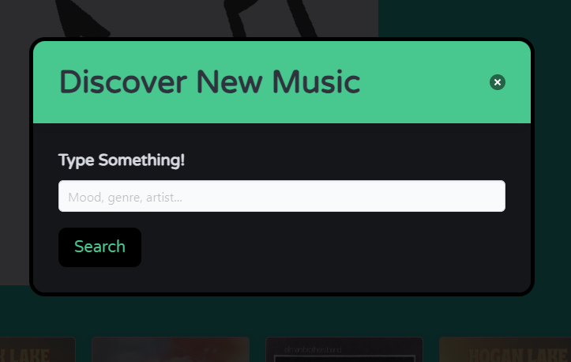
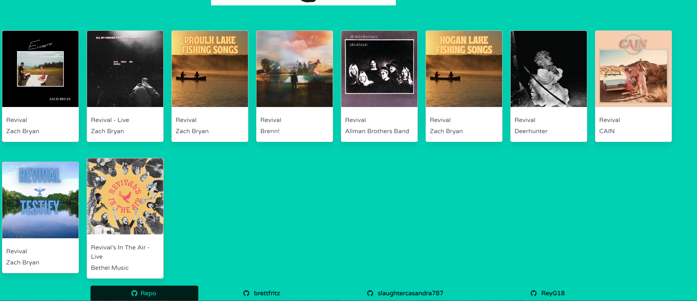
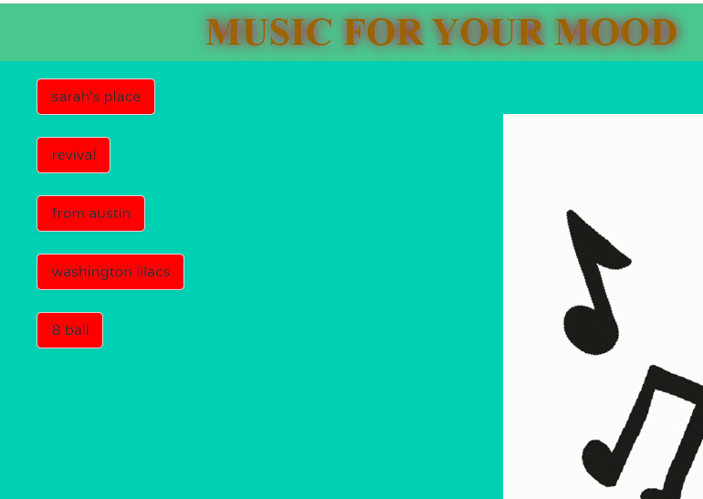
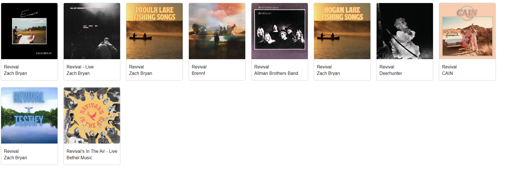

# Music For Your Mood

This is a web application called "Music for your mood" designed to help users discover new music based on their mood, genre, or favorite artists. It utilizes the Spotify API to search for tracks and display them to the user.

## Table of Contents
- [Demo/Description](#demo/description)
- [Features](#features)
- [Technologies Used](#technologies-used)
- [Setup Instructions](#setup-instructions)
- [License](#license)

## Demo/Description

1. Paste the following link in your browser in order to navigate to the website. https://brettfritz.github.io/api-music-project/ 

2. Click on the "Find A Song" button.

3. Type a keyword related to the music you're looking for in the search bar.
4. Click the "Search" button or press Enter to perform the search.
5. The top 10 tracks related to your search will be displayed utalizing the Spotify API integration to show you the song title, artist, and cover art, for the returned tracks related to your search.

6. Additionally, after each search, you can see a record of your 5 latest searches made on the left side of the webpage

7. Click on a recent search to perform the same search again.
8. Clicking on a recent search also redirects the user to a seperate page for just those results.

9. Browse through the search results to discover new music.
10. Return to the main page by simply clicking your browser's back button to make more searches.
11. At the bottom of the page, there are clickable links to the personal repositories for each of the creators of this website.
12. Enjoy!

## Features

- Users can search for songs based on keywords such as mood, genre, or artist.
- Recent searches are saved and displayed for easy access.
- Users can click on a recent search to quickly perform the same search again.
- Displays album cover images and artist information for each search result.

## Technologies Used

- HTML5
- CSS3 (Bulma framework)
- JavaScript (jQuery)
- Spotify API
- GIPHY API

## Setup Instructions

Simply follow the attached link to the live website to start exploring new music!

## Links
https://github.com/brettfritz/api-music-project

https://brettfritz.github.io/api-music-project/

## License

MIT License
